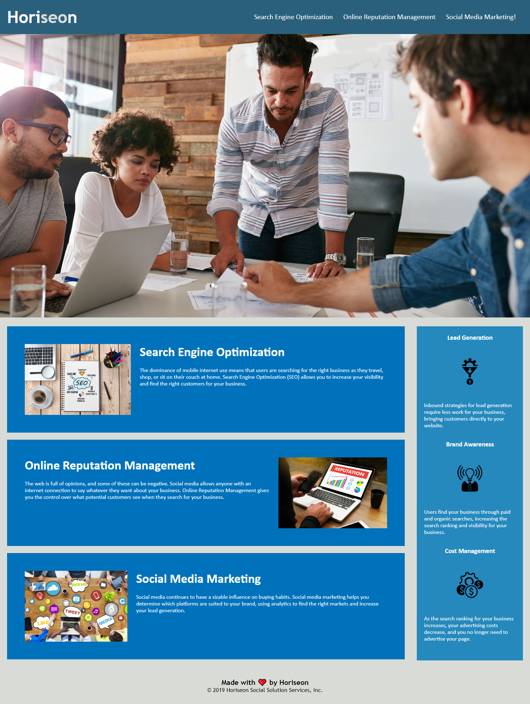

# Week 1 Challenge: Accessibility

## Description of Task
 
This week your challenge is an on-the-job ticket, which means you'll begin with starter code that you need to modify. This week's challenge involves a very important aspect of web development: **accessibility**. 
 
One of the most common tasks for front-end and junior developers is to take existing code and refactor it (recall that to refactor code is to improve it without changing what it does) to meet a certain set of standards or implement a new technology. In this challenge, a marketing agency has hired you to refactor an existing site to make it more accessible.

Even though accessibility is a broad topic that can include complex requirements, your tech lead has given you a small list of specific criteria to satisfy the project. These criteria are documented below in the Acceptance Criteria.

### User Story

```
AS A marketing agency
I WANT a codebase that follows accessibility standards
SO THAT our own site is optimized for search engines
```

### Acceptance Criteria

Your website must meet accessibility standards. You can achieve this completing the following:

* Semantic HTML elements can be found throughout the source code
* HTML elements follow a logical structure independent of styling and positioning
* Image and icon elements contain accessible `alt` attributes
* Heading attributes fall in sequential order
* Title elements contain a concise, descriptive title

---

## Final Version Post Editing

The following image shows the web application's appearance and functionality post editing:



### Relevant Links

* GitHub repository: https://github.com/Ing3rs/challenge-1-horiseon-accessibility
* Domain link: 

---
© 2022 edX Boot Camps LLC. Confidential and Proprietary. All Rights Reserved.
